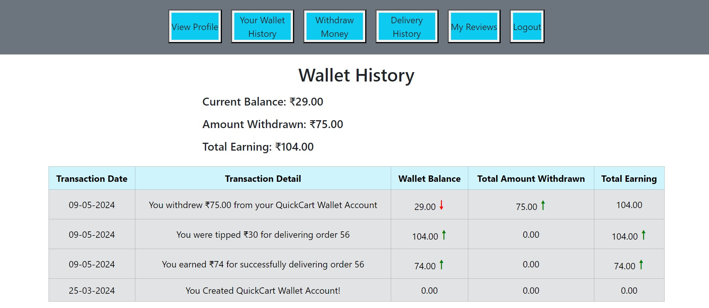
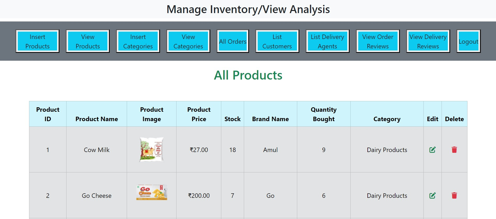

# QuickCart
A comprehensive online retail solution developed with HTML, CSS, PHP, and MySQL, featuring distinct user, admin, and delivery agent modes for streamlined browsing, purchasing, and product management.

<h3>How to Run the Web Application:</h3>

**<h4>🛠️ Prerequisites:</h4>**
- XAMPP installed on your system
- MySQL installed on your system
- Web browser
  
**<h4>🚀 Installation Steps:</h4>**
- Clone this repository to your local machine.
- Copy the entire `QuickCart` folder and paste it into the `htdocs` directory of your XAMPP installation. The `htdocs` directory is typically located at `C:\xampp\htdocs` on Windows or `/Applications/XAMPP/htdocs` on macOS.
- Import the database schema into your MySQL database. Use the provided `/quickcart.sql` file located in the main project (Quickcart) directory.
- Configure the database connection by modifying the `connect.php` file located in the `/includes` directory. Update the lines with your MySQL database credentials.
- Start the Apache and MySQL services from the XAMPP control panel.
- Open a web browser and navigate to `http://localhost/quickcart/start.php` to access the QuickCart application.

**<h4>📋 Usage:</h4>**
- As an Administrator: Use the provided administrator credentials to log in and manage products, categories, orders and view customers, delivery agents, etc.
- As a Customer: Login using your credentials or register to access the platform. Browse through the available products, add them to the cart, and proceed to checkout. You can also view and edit your profile, check order history, top up your wallet, and rate orders and deliveries.
- As a Delivery Agent: Access the delivery agent interface using specific credentials to update delivery status. You can also view and edit your profile, check your delivery history & your reviews, withdraw money from your wallet and view wallet history.

**<h4>🧑‍🤝‍🧑 Contributors:</h4>**
- Aarzoo
- Shobhit Raj
- Sidhartha Garg
- Vanshika Pal

**<h4>Screenshots:</h4>**

    <b><u>Customer Home:</u></b>  
    

   

    <b><u>Agent Wallet:</u></b>  
    

   

    <b><u>Admin Manage:</u></b>  
    

